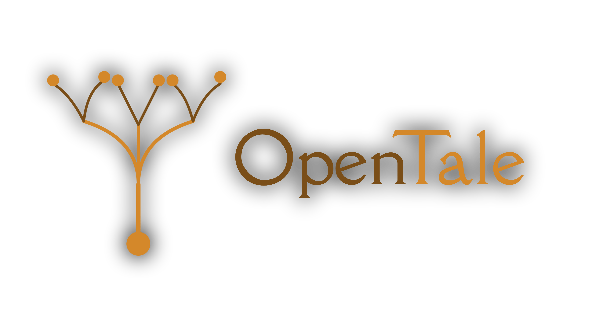
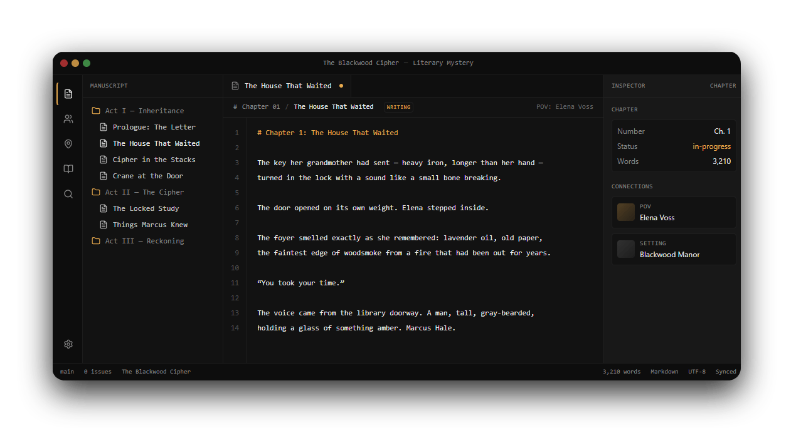

<p align="center">
  <a href="https://github.com/Hoodgail/opentales">
    
  </a>
</p>

<p align="center">
  <strong>The IDE for novelists.</strong><br />
  Write chapters, build characters, and map plot structure — all in one distraction-free workspace.<br />
  Powered by <a href="https://github.com/microsoft/monaco-editor">Monaco</a>, designed for long-form fiction.
</p>

<p align="center">
  <a href="docs/getting-started.md"><strong>Docs</strong></a> ·
  <a href="CONTRIBUTING.md"><strong>Contributing</strong></a> ·
  <a href="docs/architecture.md"><strong>Architecture</strong></a> ·
  <a href="docs/ai-system.md"><strong>AI System</strong></a> ·
  <a href="docs/future-directions.md"><strong>Roadmap</strong></a>
</p>

<p align="center">
  <a href="https://github.com/Hoodgail/opentales/stargazers"></a>
  <a href="https://github.com/Hoodgail/opentales/issues"></a>
  
  
  
</p>

<p align="center">
  <a href="https://opentales.lumina.pw">
    
  </a>
</p>

## Why OpenTales?

A novel is a codebase of human meaning — characters, places, plot threads, and prose all interconnected. OpenTales treats it that way. It's a desktop-class writing IDE that gives long-form fiction the same scaffolding software gets: structure, navigation, version history, refactor tools, and a distraction-free editor for the parts that matter most.
 
## Features

- **Monaco-powered editor.** The same editor that powers VS Code, tuned for prose. Markdown highlighting, multi-cursor, find-and-replace.
- **Living characters.** Every character is a first-class document — portraits, traits, voice samples, and relationships.
- **Path-based project docs.** Notes, references, AI instructions, and foldered assets live in a VS Code-like tree with nested custom folders.
- **Settings with atmosphere.** Upload reference imagery for every location.
- **Plot, voice, and obstacles.** Premise, theme, POV, climax, and obstacles live in their own structured panels.
- **Episodic chapters.** Acts, chapters, and scene beats organized like a project tree.
- **Drafts inbox.** Editors submit drafts; owners merge or decline with side-by-side diff. Like GitHub PRs, for prose.
- **Public read view.** Publish chapters individually under a project's public URL.
- **Mobile + PWA.** Install on iOS, Android, or desktop. Offline-ready.
- **Open-source.** Self-host, fork, extend.

## Quick start

```bash
git clone https://github.com/Hoodgail/opentales.git
cd opentales
pnpm install

cp packages/backend/.env.example packages/backend/.env
# edit DATABASE_URL and JWT_SECRET

pnpm --dir packages/backend prisma:generate
pnpm --dir packages/backend prisma:migrate
pnpm --dir packages/backend prisma:seed

# terminal 1
pnpm dev:backend
# terminal 2
pnpm dev:web
```

Open http://localhost:5173 and click **Open the editor** (or visit `/projects`).

Demo credentials from the seed: `demo@opentales.local` / `password123`.

For a full walkthrough see **[docs/getting-started.md](docs/getting-started.md)**.

## Workspace layout

```
packages/
  backend/      Express API, Prisma schema, auth, use cases, seed data
  frontend/     SvelteKit renderer (IDE + landing page)
  electron/     Electron main process and preload bridge
  sdk/          TypeScript client and shared API DTOs
docs/           Project documentation
prisma.md       Data-model design notes
```

## Requirements

| | |
| --- | --- |
| Node.js | 20+ |
| pnpm | 10+ |
| PostgreSQL | 15+ |

## Scripts

| command | description |
| --- | --- |
| `pnpm dev:web` | Start the SvelteKit frontend at `http://localhost:5173` |
| `pnpm dev:backend` | Start the backend API at `http://localhost:4000` |
| `pnpm dev` | Start frontend + Electron together |
| `pnpm check` | Frontend type checks (`svelte-check`) |
| `pnpm check:backend` | Backend type checks (`tsc --noEmit`) |
| `pnpm check:sdk` | SDK type checks |
| `pnpm build` | Build frontend, SDK, and backend |
| `pnpm package` | Build and package the Electron app |

## Stack

- **[SvelteKit](https://kit.svelte.dev)** + Svelte 5 (runes) for the renderer
- **[Electron](https://www.electronjs.org)** for desktop packaging
- **[Tailwind CSS v4](https://tailwindcss.com)** for UI styling
- **[Monaco Editor](https://github.com/microsoft/monaco-editor)** for manuscript editing
- **[Express](https://expressjs.com)** for the backend API
- **[Prisma](https://www.prisma.io)** + PostgreSQL for persistence
- **[bcrypt](https://github.com/kelektiv/node.bcrypt.js)** + JWT for auth
- TypeScript SDK for API access from the frontend

## Documentation

| | |
| --- | --- |
| **[Getting started](docs/getting-started.md)** | Local setup walkthrough — your first project in five minutes. |
| **[Architecture](docs/architecture.md)** | High-level system design, package layout, data model, and conventions. |
| **[AI system](docs/ai-system.md)** | How project AI settings, agent sessions, streaming, tool calls, and approval-gated edits work. |
| **[AI assistive features](docs/ai-assistive-features.md)** | SDK and endpoint notes for AI settings, docs, one-shot features, and agent tools. |
| **[Future directions](docs/future-directions.md)** | Roadmap, refactor opportunities, and brainstormed features for novel writing. |
| **[Contributing](CONTRIBUTING.md)** | How to set up a working copy and submit your first PR. |
| **[Backend README](packages/backend/README.md)** | Backend-specific notes. |
| **[SDK README](packages/sdk/README.md)** | SDK usage and shape. |

Project docs are organized by folders and paths, not by `kind`. The `kind` field remains metadata for filtering and internal AI behavior, especially `instructions` docs that are injected into agent prompts.

## Roadmap highlights

A few of the things we're thinking about next. Full list lives in [`docs/future-directions.md`](docs/future-directions.md).

- 🪶 **Continuity lint** — surface eye-color drift, timeline contradictions, POV slips
- 🎭 **Character voice consistency** — train per-character voice fingerprints, flag off-voice dialogue
- 📐 **Plot structure overlays** — Save the Cat, Hero's Journey, Story Grid as overlays on your chapters
- 🃏 **Scene cards** — Dwight Swain scene-and-sequel structure, drag-to-reorder
- 🧵 **Foreshadowing tracker** — link setups to payoffs across the manuscript
- 🤖 **Local-first AI** — opt-in continuity reviews, rewrites, and outline expansion (Ollama-powered)
- 🤝 **Real-time co-authoring** — CRDT-based multi-user editing on top of the existing branch model
- 📚 **Export pipeline** — EPUB, PDF (submission-formatted), audiobook scripts
- 🔌 **Self-hosting bundle** — single `docker-compose.yml`

## Contributing

Issues, PRs, design feedback, and prose-tested feature ideas are all welcome. Start with **[CONTRIBUTING.md](CONTRIBUTING.md)** for setup steps and the development workflow, then pick something from **[docs/future-directions.md](docs/future-directions.md)** that excites you.

## License

License TBD — see [`docs/future-directions.md`](docs/future-directions.md) for the roadmap. Build the writing tool you wish you had.

<p align="center">
  <sub>crafted in monospace · for writers, by writers</sub>
</p>
